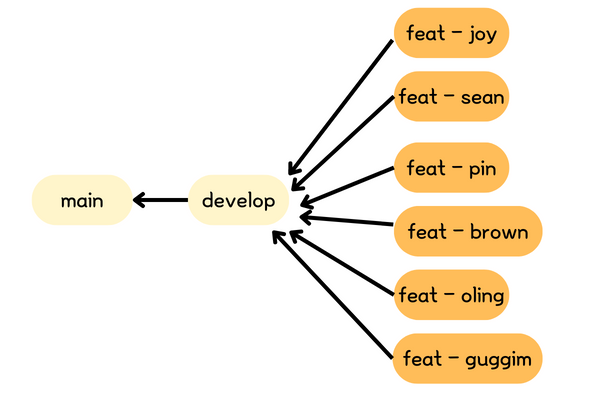

# narangnorang_ios
@Apple Developer Academy-MC1 💛<b>나랑 노랑</b>💛 팀의 레포지토리입니다.

# Git branch (Git-flow)
- `master` : 제품을 배포하는 브랜치입니다. 🚨 절대 허락 없이 이 브랜치에서 <b>새로운 브랜치를 생성하지 마세요!!!!!</b> 🚨
- `develop` : 개발자들이 작업한 코드를 합치는 브랜치입니다.
- `feature - 이름` : 예시로 `feature-joy` 로 브랜치를 생성하시면 됩니다.  `feature-이름`에서  작업한 작업물이 완료되면 develop으로 머지하시면 됩니다. 머지 전에 팀원들과 함께 진행 상황 꼭 공유하도록 하기!! MUST!! 🤔 



<br/>

# Git Commit message 규칙
```bash
git commit -m 시 "feat: 화면 전환 효과 추가" 이런 식으로 메시지 써 주시면 됩니다.
```
- `feat`: 새로운 기능 추가
- `fix`: 버그 수정
- `docs`: 문서 수정
- `test`: 테스트 코드 추가
- `refactor`: 코드 리팩토링
- `style`: 코드 의미에 영향을 주지 않는 변경사항
- `chore`: 빌드 부분 혹은 패키지 매니저 수정사항
- `init`: 프로젝트 초기 셋팅

# 참조할 만한 git 명령어
```bash
git add . #stage everything 
git commit -m "커밋 메시지" #git commit message 규칙을 참조해서 메시지를 작성합니다.
git push #Remote directory에 local directory에 올린 코드들을 업로드할 수 있습니다.
git pull #Remote directory에 있는 코드들을 local로 가져올 수 있습니다.
git branch 브랜치명 # 만일 develop 브랜치에서 git branch feat-joy 하면 develop 브랜치에서 feat-joy가 생성됩니다. 
git merge 
#만일 develop 브랜치에서 git merge feature-joy하면 feature-joy브랜치가 develop 브랜치로 머지됩니다.
#하지만 머지는 꼭 미리 joy의 감독이 필요합니다!!!🤔
```

# Git 관련 참고 자료 
- git 공식 자료: https://git-scm.com/book/ko/v2
- 누구나 쉽게 이해할 수 있는 git입문: https://backlog.com/git-tutorial/kr/
